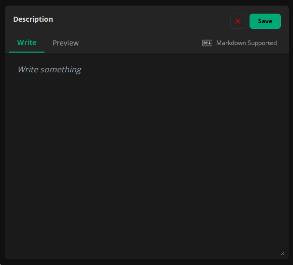

# Using Markdown

Markdown is a simple syntax that you can use to format texts. You can do things such as turning texts into bold or
italic, adding headings, adding links and much more.

## How to use

In Obserfy, you can use markdown on every text input that have the "Markdown Supported" icon.



You can write your text on the "Write" tab. And you can preview how your text is going to be formatted using the "Preview"
tab.

## Supported formatting

---

### Italics

#### <u>Syntax</u>

```markdown
_text_
```

#### <u>Result</u>

_text_

---

### Bold

#### <u>Syntax</u>

```markdown
**text**
```

#### <u>Result</u>

**text**

---

### Links

#### <u>Syntax</u>

```markdown
[this is a link](https://example.com)
```

#### <u>Result</u>

<div />

[this is a link](https://example.com)

---


### Headings

#### <u>Syntax</u>

```markdown
# Heading 1

## Heading 2

### Heading 3

#### Heading 4
```

#### <u>Result</u>

<h1 className={"my-2"}>Heading 1</h1>
<h2 className={"my-2"}>Heading 2</h2>
<h3 className={"my-2"}>Heading 3</h3>
<h4 className={"mb-8"}>Heading 4</h4>
